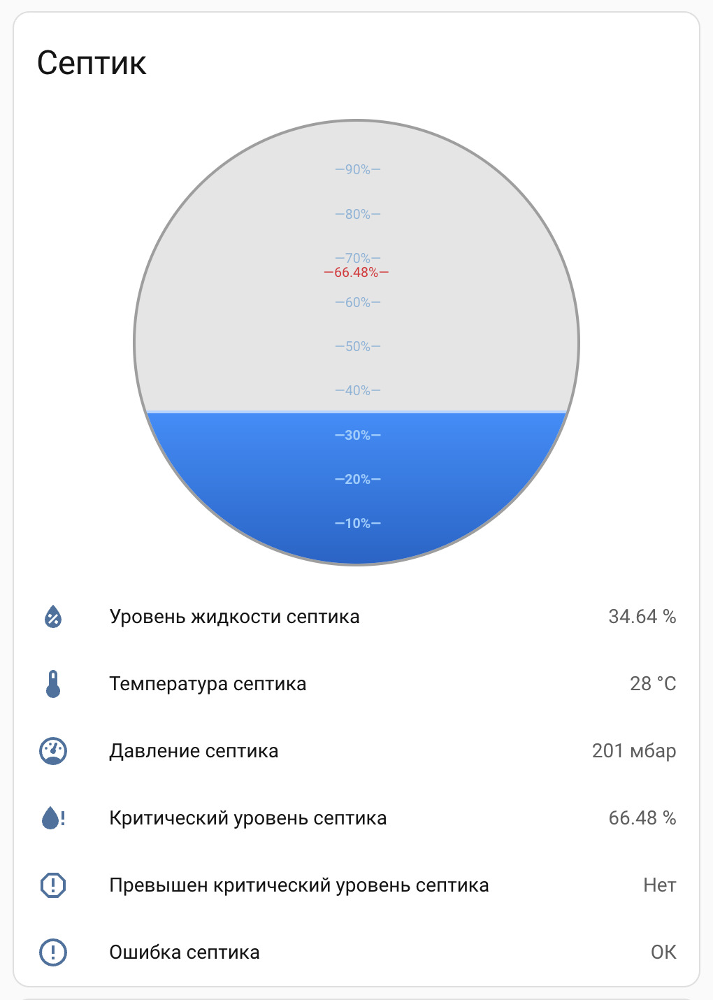

# GSeptik

GSeptik is a set of custom Lovelace cards for **Home Assistant** designed to visualize septic tank data in a clear and intuitive way. The project focuses on visual level representation rather than historical charts or complex controls. The goal is to provide simple, readable, and domain-specific UI elements instead of generic gauges or charts.

GSeptik provides visual components to display:

- Septic tank fill level
- Critical level thresholds
- Related sensor data (temperature, pressure, errors)



## Table of contents

- [Installation](#installation)
  - [HACS (planned)](#hacs-installation)
  - [Manual installation](#manual-installation)
    - [Using the UI](#using-the-ui)
    - [Using YAML](#using-yaml)
- [Usage](#usage)
  - [Using the UI (Visual editor)](#using-the-ui-visual-editor)
  - [Using YAML (Raw configuration)](#using-yaml-raw-configuration)
- [Configuration](#configuration)
  - [Entities](#entities)
  - [Display options](#display-options)
  - [Example configuration](#example-configuration)
- [Development](#development)
  - [Build module](#build-module)
  - [Run development server](#run-development-server)
  - [Run Home Assistant server](#run-home-assistant-server)
  - [Configure Home Assistant server](#configure-home-assistant-server)
  - [Use ui-gseptik dashboard](#use-ui-gseptik-dashboard)

## Installation

### HACS installation

HACS support is in progress but not yet available.


### Manual installation

First, download the latest `gseptik-card.js` file from the releases page and copy it to your Home Assistant `www` directory: `/config/www/gseptik/gseptik-card.js`. Then add the resource to Home Assistant using one of the following methods.

#### Using the UI

1. Go to Settings → Dashboards → Resources
2. Click Add Resource
3. Set the URL to: `/local/gseptik/gseptik-card.js`
4. Select **JavaScript Module** as the resource type

#### Using YAML

Add the following to your Lovelace configuration:

```yaml
resources:
  - url: /local/gseptik/gseptik-card.js
    type: module
```

Restart the browser or clear cache if the card does not appear immediately.

## Usage

GSeptik cards can be added to a Home Assistant dashboard using either the visual editor (UI) or manual YAML configuration.

The following cards are available:
- **GSeptik Cistern Card** (`custom:gseptik-cistern-card`)
- **GSeptik Tile Card** (`custom:gseptik-tile-card`)
- **GSeptik Badge** (`custom:gseptik-badge`)

### Using the UI (Visual editor)

1. Open any dashboard in Home Assistant
2. Click **Edit dashboard**
3. Click **Add card**
4. Select **Manual card**
5. Paste the configuration below and save

Example configuration:

```yaml
type: custom:gseptik-cistern-card
entities:
  level: uroven_zhidkosti_septika
  temp: temperatura_septika
  pressure: davlenie_septika
  x_level: kriticheskii_uroven_septika
  exceeds_x_level: prevyshen_kriticheskii_uroven_septika
  error_name: oshibka_septika
```

### Using YAML (Raw configuration)

If you are using dashboards in YAML mode, add the card configuration directly to your view definition:

```yaml
views:
  - title: Home
    cards:
      - type: custom:gseptik-cistern-card
        entities:
          level: uroven_zhidkosti_septika
          temp: temperatura_septika
          pressure: davlenie_septika
          x_level: kriticheskii_uroven_septika
          exceeds_x_level: prevyshen_kriticheskii_uroven_septika
          error_name: oshibka_septika
```

Save the dashboard configuration. The card will appear immediately after saving.

## Configuration

This section describes all available configuration options for GSeptik cards. New parameters may be added in future versions.

### Entities

Each entity represents a specific septic tank parameter and may define a custom icon.

| Key | Entity example | Icon | Description |
|----|---------------|------|-------------|
| `level` | `sensor.uroven_zhidkosti_septika` | `mdi:water-percent` | Current septic tank fill level |
| `temp` | `sensor.temperatura_septika` | `mdi:thermometer` | Septic tank temperature |
| `pressure` | `sensor.davlenie_septika` | `mdi:gauge` | Internal pressure |
| `x_level` | `sensor.kriticheskii_uroven_septika` | `mdi:water-alert` | Critical level threshold |
| `exceeds_x_level` | `sensor.prevyshen_kriticheskii_uroven_septika` | `mdi:alert-octagon-outline` | Indicates critical level exceeded |
| `error_name` | `sensor.oshibka_septika` | `mdi:alert-circle-outline` | Error state or error description |

### Display options

| Parameter | Type | Default | Description |
|---------|------|---------|-------------|
| `show_title` | boolean | `true` | Show or hide the card title |

### Example configuration

```yaml
type: custom:gseptik-cistern-card
show_title: true
entities:
  level:
    entity: sensor.uroven_zhidkosti_septika
    icon: mdi:water-percent
  temp:
    entity: sensor.temperatura_septika
    icon: mdi:thermometer
  pressure:
    entity: sensor.davlenie_septika
    icon: mdi:gauge
  x_level:
    entity: sensor.kriticheskii_uroven_septika
    icon: mdi:water-alert
  exceeds_x_level:
    entity: sensor.prevyshen_kriticheskii_uroven_septika
    icon: mdi:alert-octagon-outline
  error_name:
    entity: sensor.oshibka_septika
    icon: mdi:alert-circle-outline
```

## Development

## Build module

Run the build process using the command `npm run build`. The compiled JavaScript module will be located in the `dist` directory.

### Run development server

Install Node.js dependencies using the command `npm install`. Start the development server with the command `npm start`. The development server runs at http://localhost:4000.

### Run Home Assistant server

Start the Home Assistant server using the command `npm run start:hass`. Home Assistant will be available at http://localhost:8123. The Home Assistant configuration includes the following module URL:


```
frontend:
  themes: !include_dir_merge_named themes
  extra_module_url:
    - http://localhost:4000/gseptik-card.js
```

This demo setup also uses REST sensors defined in `rests.yaml`. In `configuration.yaml` it is included as:


```
# Include extra configuration
rest: !include rests.yaml
```

The REST sensors use a public endpoint like `https://data.gseptik.ru/Api/public/v2/home-assistant/readings/<TOKEN>`. If you need your own token, you can get it from the GSeptik personal account at https://gseptik.ru/. The website also supports “login as guest” for a quick demo.

### Configure Home Assistant server

You can add the cards in two ways: using the UI or by editing Lovelace YAML. In UI mode, add a new card and choose Manual.  For YAML mode, select any dashboard, take control if necessary, open the Raw configuration editor (YAML mode), and add the cards to your view, for example:

```yaml
views:
  - path: default_view
    title: Home
    cards:
      - type: custom:gseptik-cistern-card
        entities:
          level: uroven_zhidkosti_septika
          temp: temperatura_septika
          pressure: davlenie_septika
          x_level: kriticheskii_uroven_septika
          exceeds_x_level: prevyshen_kriticheskii_uroven_septika
          error_name: oshibka_septika
      - type: custom:gseptik-tile-card
        entities:
          level: uroven_zhidkosti_septika
          temp: temperatura_septika
          pressure: davlenie_septika
          x_level: kriticheskii_uroven_septika
          exceeds_x_level: prevyshen_kriticheskii_uroven_septika
          error_name: oshibka_septika
```

Save the dashboard. If the development server is running on port 4000, the cards should render immediately using the live development build.


### Use ui-gseptik dashboard

To try the demo dashboard, [install HACS](https://blog.iot7m.ru/how-to-setup-hacs?utm_source=github&utm_medium=readme) in your Home Assistant config directory (`.hass`). After installing HACS, install the following frontend cards via HACS:
- card-mod
- gauge-card-pro
- stack-in-card

Then copy the contents of `.hass/ui-gseptik.yaml` and paste it into any dashboard using the Raw configuration editor (YAML mode).

