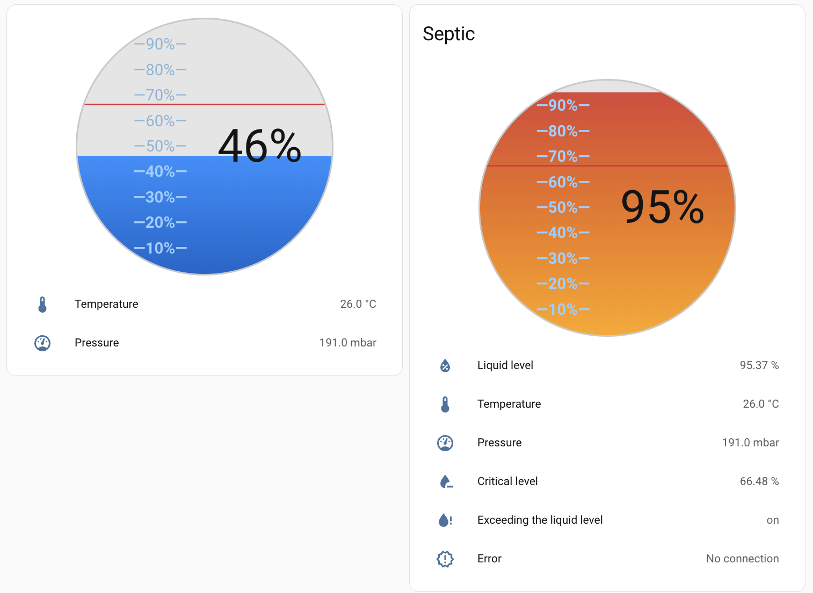

# Septic Tank

Septic is a set of custom Lovelace cards for **Home Assistant** designed to visualize septic tank data in a clear and intuitive way. The project focuses on visual level representation rather than historical charts or complex controls. The goal is to provide simple, readable, and domain-specific UI elements instead of generic gauges or charts.

Septic provides visual components to display:

- Septic tank fill level
- Critical level thresholds
- Related sensor data (temperature, pressure, errors)



## Table of contents

- [Installation](#installation)
  - [HACS installation](#hacs-installation)
  - [Manual installation](#manual-installation)
    - [Using the UI](#using-the-ui)
    - [Using YAML](#using-yaml)
- [Usage](#usage)
  - [Using the UI (Visual editor)](#using-the-ui-visual-editor)
  - [Using YAML (Raw configuration)](#using-yaml-raw-configuration)
- [Configuration](#configuration)
  - [Entities configuration](#entities-configuration)
  - [Tank display options](#tank-display-options)
  - [Pressure display options](#pressure-display-options)
  - [Critical level display options](#critical-level-display-options)
  - [Level display options](#level-display-options)
  - [Temperature display options](#temperature-display-options)
  - [Critical level exceeded indicator display options](#critical-level-exceeded-indicator-display-options)
  - [SDT display options](#sdt-display-options)
  - [Error display options](#error-display-options)
  - [Complete configuration example](#complete-configuration-example)
  - [Multiple cards configuration](#multiple-cards-configuration)
- [Development](#development)
  - [Build module](#build-module)
  - [Run development server](#run-development-server)
  - [Run Home Assistant server](#run-home-assistant-server)
  - [Configure Home Assistant server](#configure-home-assistant-server)
  - [Use ui-septic dashboard](#use-ui-septic-dashboard)
- [Release workflow](#release-workflow)


## Installation

### HACS installation

The card can be installed via HACS custom repository.

### Manual installation

First, download the latest `septic-card.js` file from the releases page and copy it to your Home Assistant `www` directory: `/config/www/septic/septic-card.js`. Then add the resource to Home Assistant using one of the following methods.

#### Using the UI

1. Go to Settings → Dashboards → Resources
2. Click Add Resource
3. Set the URL to: `/local/septic/septic-card.js`
4. Select **JavaScript Module** as the resource type

#### Using YAML

Add the following to your Lovelace configuration:

```yaml
resources:
  - url: /local/septic/septic-card.js
    type: module
```

Restart the browser or clear cache if the card does not appear immediately.

## Usage

Septic cards can be added to a Home Assistant dashboard using either the visual editor (UI) or manual YAML configuration.

The following cards are available:
- **Septic Tank Card** (`custom:septic-tank-card`)
- **Septic Tile Card** (`custom:septic-tile-card`)
- **Septic Badge** (`custom:septic-badge`)

### Using the UI (Visual editor)

1. Open any dashboard in Home Assistant
2. Click **Edit dashboard**
3. Click **Add card**
4. Select **Manual card**
5. Paste the configuration below and save

Basic configuration example:

```yaml
type: custom:septic-tank-card
entities:
  level: sensor.septic_tank_liquid_level
  temp: sensor.septic_tank_temperature
  pressure: sensor.septic_tank_pressure
  x_level: sensor.septic_tank_critical_level
  exceeds_x_level: binary_sensor.septic_tank_exceeds_critical_level
  sdt: sensor.septic_tank_sdt
  error_name: sensor.septic_tank_error
```

### Using YAML (Raw configuration)

If you are using dashboards in YAML mode, add the card configuration directly to your view definition:

```yaml
views:
  - title: Home
    cards:
      - type: custom:septic-tank-card
        entities:
          level: sensor.septic_tank_liquid_level
          temp: sensor.septic_tank_temperature
          pressure: sensor.septic_tank_pressure
          x_level: sensor.septic_tank_critical_level
          exceeds_x_level: binary_sensor.septic_tank_exceeds_critical_level
          sdt: sensor.septic_tank_sdt
          error_name: sensor.septic_tank_error
```

Save the dashboard configuration. The card will appear immediately after saving.

## Configuration

This section describes all available configuration options for Septic cards. New parameters may be added in future versions.

### Entities configuration

Each entity represents a specific septic tank parameter.

| Parameter         | Type   | Required | Default | Description                                         |
|-------------------|--------|----------|---------|-----------------------------------------------------|
| `level`           | entity | Yes      | —       | Current septic tank fill level                      |
| `temp`            | entity | Yes      | —       | Septic tank temperature                             |
| `pressure`        | entity | Yes      | —       | Internal pressure                                   |
| `x_level`         | entity | Yes      | —       | Critical level threshold                            |
| `exceeds_x_level` | entity | Yes      | —       | Indicates that the critical level has been exceeded |
| `sdt`             | entity | Yes      | —       | Signal level (SDT)                                  |
| `error_name`      | entity | Yes      | —       | Error state or error description                    |

### Tank display options

The `tank` section controls the visual representation of the tank itself. All subsections are optional.

```yaml
tank:
  header:
    show: true
    label: Septic Tank
  level:
    show: true
  scale:
    position: left
```

#### Header display options

The header section controls the card title displayed at the top of the card.  By default, the header is hidden. You can enable the header and optionally provide a custom label.

| Parameter | Type    | Required | Default | Description              |
|-----------|---------|----------|---------|--------------------------|
| `show`    | boolean | No       | `false` | Show or hide card header |
| `label`   | string  | No       | Septic  | Header text              |


#### Level display options

Controls visibility of the tank fill level indicator.  By default, the level is hidden.

| Parameter | Type    | Required | Default | Description                  |
|-----------|---------|----------|---------|------------------------------|
| `show`    | boolean | No       | `false` | Show or hide level indicator |

#### Scale display options

Controls the position of the tank scale.  By default, the scale position is middle.

| Parameter  | Type               | Required | Default  | Description            |
|------------|--------------------|----------|----------|------------------------|
| `position` | `left` \| `middle` | No       | `middle` | Scale position on tank |


### Pressure display options

Controls how the pressure  (`pressure`) entity is displayed on the card. By default, the pressure entity is shown using the card’s predefined icon and the default label.

| Parameter | Type    | Required | Default     | Description             |
|-----------|---------|----------|-------------|-------------------------|
| `show`    | boolean | No       | `true`      | Show or hide the entity |
| `label`   | string  | No       | Pressure    | Custom label            |
| `icon`    | string  | No       | `mdi:gauge` | Custom icon             |


### Critical level display options

Controls how the critical level threshold (`x_level`) entity is displayed on the card.  By default, the critical level entity is shown using the card’s predefined icon and the default label.

| Parameter | Type    | Required | Default           | Description             |
|-----------|---------|----------|-------------------|-------------------------|
| `show`    | boolean | No       | `false`           | Show or hide the entity |
| `label`   | string  | No       | Critical level    | Custom label            |
| `icon`    | string  | No       | `mdi:water-minus` | Custom icon             |


### Level display options

Controls how the current fill level (`level`) entity is displayed on the card. By default, the level entity is shown using the card’s predefined icon and the default label.

| Parameter | Type    | Required | Default             | Description             |
|-----------|---------|----------|---------------------|-------------------------|
| `show`    | boolean | No       | `false`             | Show or hide the entity |
| `label`   | string  | No       | Liquid level        | Custom label            |
| `icon`    | string  | No       | `mdi:water-percent` | Custom icon             |


### Temperature display options

Controls how the temperature (`temp`) entity is displayed on the card. By default, the temperature entity is shown using the card’s predefined icon and the default label.

| Parameter | Type    | Required | Default           | Description             |
|-----------|---------|----------|-------------------|-------------------------|
| `show`    | boolean | No       | `true`            | Show or hide the entity |
| `label`   | string  | No       | Temperature       | Custom label            |
| `icon`    | string  | No       | `mdi:thermometer` | Custom icon             |

### Critical level exceeded indicator display options

Controls how the critical level exceeded indicator (`exceeds_x_level`) is displayed on the card. By default, the indicator is shown using the card’s predefined icon and the default label.

| Parameter | Type    | Required | Default                    | Description             |
|-----------|---------|----------|----------------------------|-------------------------|
| `show`    | boolean | No       | `false`                    | Show or hide the entity |
| `label`   | string  | No       | Exceeding the liquid level | Custom label            |
| `icon`    | string  | No       | `mdi:water-alert`          | Custom icon             |


### SDT display options

Controls how the SDT (`sdt`) entity is displayed on the card. By default, the SDT entity is hidden.

| Parameter | Type    | Required | Default      | Description             |
|-----------|---------|----------|--------------|-------------------------|
| `show`    | boolean | No       | `false`      | Show or hide the entity |
| `label`   | string  | No       | SDT          | Custom label            |
| `icon`    | string  | No       | `mdi:signal` | Custom icon             |

### Error display options

Controls how the error entity (`error_name`) is displayed on the card.  By default, the error entity is shown using the card’s predefined icon and the default label.

The `error_name` entity has special behavior.  It is displayed if `show` is set to `true` and when an error occurs, even if `show` is set to `false`. The entity is hidden when its state is `ok`, `unknown`, or `unavailable`.

| Parameter | Type    | Required | Default                      | Description             |
|-----------|---------|----------|------------------------------|-------------------------|
| `show`    | boolean | No       | `false`                      | Show or hide the entity |
| `label`   | string  | No       | Error                        | Custom label            |
| `icon`    | string  | No       | `mdi:alert-decagram-outline` | Custom icon             |


### Complete configuration example

This example demonstrates a complete configuration of the Septic tank card, including all supported entities and display options.

```yaml
type: custom:septic-tank-card
entities:
  level: sensor.septic_tank_liquid_level
  temp: sensor.septic_tank_temperature
  pressure: sensor.septic_tank_pressure
  x_level: sensor.septic_tank_critical_level
  exceeds_x_level: binary_sensor.septic_tank_exceeds_critical_level
  sdt: sensor.septic_tank_sdt
  error_name: sensor.septic_tank_error
tank:
  header:
    show: true
    label: My septic tank
  level:
    show: true
  scale:
    position: left
level:
  show: true
  icon: mdi:water-percent
  label: Liquid level
temp:
  show: true
  label: Temperature
  icon: mdi:temperature
pressure:
  show: true
  label: Pressure
  icon: mdi:gauge
x_level:
  show: true
  label: Critical level
  icon: mdi:water-minus
exceeds_x_level:
  show: true
  label: Exceeding the liquid level
  icon: mdi:water-alert
sdt:
  show: true
  label: SDT
  icon: mdi:signal
error_name:
  show: true
  label: Error
  icon: mdi:alert-decagram-outline
```

### Multiple cards configuration

This example demonstrates how to use multiple Septic cards on the same dashboard, each with its own independent configuration.

```yaml
- type: custom:septic-tank-card
  entities:
    level: sensor.septic_tank_liquid_level
    temp: sensor.septic_tank_temperature
    pressure: sensor.septic_tank_pressure
    x_level: sensor.septic_tank_critical_level
    exceeds_x_level: binary_sensor.septic_tank_exceeds_critical_level
    sdt: sensor.septic_tank_sdt
    error_name: sensor.septic_tank_error
  tank:
    header:
      show: true
      label: My septic tank

- type: custom:septic-tank-card
  entities:
    level: sensor.septic_tank_2_liquid_level
    temp: sensor.septic_tank_2_temperature
    pressure: sensor.septic_tank_2_pressure
    x_level: sensor.septic_tank_2_critical_level
    exceeds_x_level: binary_sensor.septic_tank_2_exceeds_critical_level
    sdt: sensor.septic_tank_2_sdt
    error_name: sensor.septic_tank_2_error
  tank:
    header:
      show: true
      label: My septic tank 2
```


## Development

## Build module

Run the build process using the command `npm run build`. The compiled JavaScript module will be located in the `dist` directory.

### Run development server

Install Node.js dependencies using the command `npm install`. Start the development server with the command `npm start`. The development server runs at http://localhost:4000.

### Run Home Assistant server

Start the Home Assistant server using the command `npm run start:hass`. Home Assistant will be available at http://localhost:8123. The Home Assistant configuration includes the following module URL:


```
frontend:
  themes: !include_dir_merge_named themes
  extra_module_url:
    - http://localhost:4000/septic-card.js
```

This demo setup uses Home Assistant helpers (`input_number`, `input_boolean`, `input_text`) combined with template sensors to emulate septic tank data locally. This allows running the demo without any external services or network dependencies. In `configuration.yaml` it is included as:


```
# Include extra configuration
input_number: !include input_numbers.yaml
input_boolean: !include input_booleans.yaml
input_text: !include input_texts.yaml
template: !include templates.yaml
```

### Configure Home Assistant server

You can add the cards in two ways: using the UI or by editing Lovelace YAML. In UI mode, add a new card and choose Manual.  For YAML mode, select any dashboard, take control if necessary, open the Raw configuration editor (YAML mode), and add the cards to your view, for example:

```yaml
views:
  - path: default_view
    title: Home
    cards:
      - type: custom:septic-tank-card
        entities:
          level: sensor.septic_tank_liquid_level
          temp: sensor.septic_tank_temperature
          pressure: sensor.septic_tank_pressure
          x_level: sensor.septic_tank_critical_level
          exceeds_x_level: binary_sensor.septic_tank_exceeds_critical_level
          sdt: sensor.septic_tank_sdt
          error_name: sensor.septic_tank_error
      - type: custom:septic-tile-card
        entities:
          level: sensor.septic_tank_liquid_level
          temp: sensor.septic_tank_temperature
          pressure: sensor.septic_tank_pressure
          x_level: sensor.septic_tank_critical_level
          exceeds_x_level: binary_sensor.septic_tank_exceeds_critical_level
          sdt: sensor.septic_tank_sdt
          error_name: sensor.septic_tank_error
```

Save the dashboard. If the development server is running on port 4000, the cards should render immediately using the live development build.


### Use ui-septic dashboard

To try the demo dashboard, [install HACS](https://blog.iot7m.ru/how-to-setup-hacs?utm_source=github&utm_medium=readme) in your Home Assistant config directory (`.hass`). After installing HACS, install the following frontend cards via HACS:
- card-mod
- gauge-card-pro
- stack-in-card

Then copy the contents of `.hass/ui-septic.yaml` and paste it into any dashboard using the Raw configuration editor (YAML mode).


## Release workflow

- update version in package.json and run npm run build
- add or update changelog files in docs (changelogs/vX.Y.Z)
- update version in antora.yml to the release version (vX.Y.Z)
- commit all changes to main and create release vX.Y.Z
- update antora.yml version in main to latest and push it
